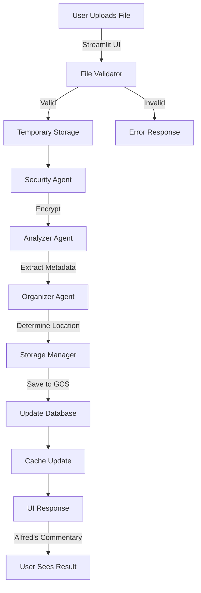

# ARCHITECTURE.md - Project Synergy Technical Specification

## 📁 Project Structure

```
synergy-file-org/
├── .env.example                    # Environment variables template
├── .gitignore                      # Git ignore rules
├── README.md                       # Project overview
├── PLAN.md                         # Vision document
├── ARCHITECTURE.md                 # This file
├── requirements.txt                # Python dependencies
├── docker-compose.yml              # Local development setup
├── Dockerfile                      # Container configuration
├── alfred.service                  # SystemD service file (Linux)
├── alfred.plist                    # LaunchAgent file (macOS)
├── alfred_installer.iss            # InnoSetup script (Windows)
│
├── src/                           # Source code root
│   ├── __init__.py
│   ├── main.py                    # Application entry point
│   ├── config.py                  # Configuration management
│   │
│   ├── agents/                    # Google ADK agents
│   │   ├── __init__.py
│   │   ├── alfred.py              # Main butler agent
│   │   ├── analyzer.py            # Document analysis agent
│   │   ├── organizer.py           # File organization agent
│   │   └── security_agent.py      # Encryption/decryption agent
│   │
│   ├── core/                      # Core business logic
│   │   ├── __init__.py
│   │   ├── file_processor.py      # File handling utilities
│   │   ├── gemini_client.py       # Gemini API wrapper
│   │   ├── storage_manager.py     # GCS operations
│   │   ├── encryption.py          # Security utilities
│   │   └── cache_manager.py       # Caching layer
│   │
│   ├── models/                    # Data models
│   │   ├── __init__.py
│   │   ├── file_metadata.py       # File information schema
│   │   ├── organization_rules.py  # Categorization models
│   │   └── user_preferences.py    # User settings schema
│   │
│   ├── api/                       # API layer (for future)
│   │   ├── __init__.py
│   │   ├── routes.py              # FastAPI routes
│   │   └── websocket.py           # Real-time updates
│   │
│   ├── ui/                        # User interface
│   │   ├── __init__.py
│   │   ├── streamlit_app.py       # Main Streamlit app
│   │   ├── components/            # UI components
│   │   │   ├── file_uploader.py
│   │   │   ├── file_browser.py
│   │   │   ├── alfred_chat.py
│   │   │   └── analytics_dash.py
│   │   └── styles/                # CSS and styling
│   │       └── custom.css
│   │
│   └── utils/                     # Utility functions
│       ├── __init__.py
│       ├── helpers.py             # General utilities
│       ├── validators.py          # Input validation
│       └── formatters.py          # Output formatting
│
├── tests/                         # Test suite
│   ├── unit/                      # Unit tests
│   ├── integration/               # Integration tests
│   └── fixtures/                  # Test data
│
├── data/                          # Local data storage
│   ├── cache/                     # Temporary cache
│   ├── uploads/                   # Temporary uploads
│   └── configs/                   # User configurations
│
├── scripts/                       # Utility scripts
│   ├── setup.py                   # Initial setup
│   ├── migrate.py                 # Data migration
│   └── cleanup.py                 # Maintenance scripts
│
└── docs/                          # Documentation
    ├── API.md                     # API documentation
    ├── DEPLOYMENT.md              # Deployment guide
    └── SECURITY.md                # Security documentation
```

## 🧠 Core Components Specification

### 1. Alfred - The Main Butler Agent (`alfred.py`)

**Purpose**: Orchestrates all file organization activities with personality

**Specifications**:
```python
class AlfredAgent(Agent):
    """
    The main orchestrator with British butler personality.
    Coordinates between analyzer and organizer agents.
    """
    
    personality = """
    You are Alfred, a sophisticated British AI butler.
    You're obsessively organized but charming about it.
    You make subtle jokes about human disorganization.
    You celebrate organization victories with understated enthusiasm.
    """
    
    def __init__(self):
        super().__init__(
            name="alfred_butler",
            model="gemini-2.5-flash",  # Fast responses for main interactions
            instruction=self.personality,
            tools=[
                self.analyze_file,
                self.organize_file,
                self.generate_summary,
                self.suggest_filing
            ]
        )
    
    async def process_file(self, file_data: FileUpload) -> FileResponse:
        """
        Main entry point for file processing.
        
        Args:
            file_data: Uploaded file information
            
        Returns:
            FileResponse with organization details and Alfred's commentary
        """
```

**Key Methods**:
- `greet_user()`: Personalized greetings based on time and user history
- `analyze_chaos()`: Assess the current state of user's file system
- `celebrate_success()`: Acknowledge organization milestones
- `provide_tips()`: Context-aware organization suggestions

### 2. Document Analyzer Agent (`analyzer.py`)

**Purpose**: Extracts meaning and metadata from documents

**Specifications**:
```python
class AnalyzerAgent(Agent):
    """
    Specialized agent for document analysis using Gemini.
    Handles all document types through multimodal analysis.
    """
    
    def __init__(self):
        super().__init__(
            name="document_analyzer",
            model="gemini-2.5-pro",  # Pro model for complex document understanding
            instruction="Analyze documents for content, type, and metadata extraction"
        )
    
    async def analyze_document(self, file_path: str) -> DocumentAnalysis:
        """
        The 'shortcut' approach: Convert everything to images, 
        let Gemini figure it out.
        """
        # Step 1: Convert to images if PDF
        if file_path.endswith('.pdf'):
            images = self._pdf_to_images(file_path)
        else:
            images = [file_path]
        
        # Step 2: One big prompt to Gemini
        prompt = """
        Analyze these document images and extract:
        1. Document type (invoice, contract, report, etc.)
        2. Key entities (companies, people, dates, amounts)
        3. Suggested folder structure
        4. Security classification
        5. Summary in 2 sentences
        6. Relevant tags
        7. Better filename suggestion
        
        If multiple pages, understand the complete context.
        Return as JSON.
        """
        
        return await self._gemini_analyze(images, prompt)
```

**Analysis Pipeline**:
1. **File Intake** → 2. **Format Detection** → 3. **Image Conversion** → 4. **Gemini Analysis** → 5. **Metadata Extraction** → 6. **Confidence Scoring**

### 3. File Organizer Agent (`organizer.py`)

**Purpose**: Determines optimal file organization structure

**Specifications**:
```python
class OrganizerAgent(Agent):
    """
    Decides where files should go based on content and user patterns.
    Learns from user behavior over time.
    """
    
    def __init__(self):
        super().__init__(
            name="file_organizer",
            model="gemini-2.5-flash",  # Fast for quick organization decisions
            instruction="Create intuitive folder structures based on document content"
        )
    
    async def determine_location(
        self, 
        analysis: DocumentAnalysis,
        user_history: UserHistory
    ) -> FileLocation:
        """
        Smart filing decision based on:
        - Document analysis
        - User's existing structure
        - Historical patterns
        - Best practices
        """
```

**Organization Strategies**:
- **Type-Based**: `/Documents/Invoices/2024/` - Easy to browse!
- **Project-Based**: `/Projects/ClientName/Contracts/` - Logical grouping
- **Time-Based**: `/Archive/2024/Q1/` - Chronological order
- **Smart Hybrid**: Combination based on user preference
- **Always Human-Readable**: No cryptic folders or UUIDs in paths!

### 4. Security Agent (`security_agent.py`)

**Purpose**: Handles encryption, decryption, and access control

**Specifications**:
```python
class SecurityAgent:
    """
    Handles encryption and security operations while keeping files accessible.
    Files remain in user-friendly locations.
    """
    
    def encrypt_file(self, file_data: bytes, user_key: str) -> EncryptedFile:
        """
        AES-256 encryption with user-specific keys.
        Key derivation from user password + salt.
        """
        
    def generate_user_friendly_path(self, user_id: str, file_analysis: Dict) -> str:
        """
        Creates human-readable storage paths:
        /Documents/Invoices/2024/Amazon_Invoice_March.pdf
        /Projects/ClientName/Contracts/Agreement_v2.pdf
        
        Users can navigate to these in their file browser!
        """
```

## 🔄 Data Flow Architecture

### File Upload Flow


### Real-time Processing Pipeline
```python
# Pseudo-code for main processing pipeline
async def process_file_pipeline(file: UploadedFile):
    # 1. Immediate UI feedback
    await ui.show_loading_animation("Alfred is examining your file...")
    
    # 2. Parallel processing
    async with asyncio.TaskGroup() as tg:
        # Generate preview thumbnail
        preview_task = tg.create_task(generate_preview(file))
        
        # Start analysis
        analysis_task = tg.create_task(analyzer.analyze(file))
        
        # Check cache for similar files
        cache_task = tg.create_task(cache.find_similar(file))
    
    # 3. Stream results as they come
    async for update in process_updates():
        await ui.update_progress(update)
    
    # 4. Final organization
    location = await organizer.determine_location(analysis_result)
    
    # 5. Alfred's touch
    response = await alfred.craft_response(analysis_result, location)
    
    return response
```

## 🖥️ Background Service Architecture

### Always-On File Monitoring
```python
class FileWatcher:
    """
    Runs as a system service/daemon, watching for new files.
    Sits quietly in the system tray, doing the grunt work.
    """
    
    def __init__(self):
        self.watch_folders = [
            os.path.expanduser("~/Downloads"),
            os.path.expanduser("~/Desktop"),
            os.path.expanduser("~/Documents")
        ]
        
    async def watch_and_organize(self):
        """
        Monitors folders and automatically:
        1. Detects new files
        2. Analyzes them with Gemini 2.5
        3. Moves them to proper locations
        4. Notifies user with Alfred's commentary
        """
```

### System Tray Integration
- **Windows**: System tray icon with right-click menu
- **macOS**: Menu bar app with dropdown
- **Linux**: AppIndicator support

### User-Friendly Features
- **Pause/Resume**: "Take a break, Alfred"
- **Folder Picker**: "Watch this folder too"
- **Undo Last**: "Oops, put that back"
- **Open Organized Folder**: Direct navigation to organized files

## 💾 Data Models

### File Metadata Schema
```python
@dataclass
class FileMetadata:
    # Identity
    file_id: str          # UUID v4
    original_name: str    # User's file name
    cleaned_name: str     # Alfred's suggestion
    
    # Classification
    file_type: str        # mime type
    document_type: str    # invoice, contract, etc.
    confidence: float     # 0.0 - 1.0
    
    # Organization
    current_path: str     # Human-readable: /Documents/Invoices/2024/
    suggested_path: str   # Where it should go (also human-readable)
    display_name: str     # Pretty name for UI display
    actual_filename: str  # Actual filename on disk
    tags: List[str]       # Searchable tags
    categories: List[str] # Hierarchical categories
    
    # Security
    encryption_key_id: str
    access_level: str     # public, private, confidential
    
    # Timestamps
    uploaded_at: datetime
    analyzed_at: datetime
    organized_at: datetime
    last_accessed: datetime
    
    # Analysis Results
    gemini_analysis: Dict[str, Any]
    summary: str
    key_entities: List[Entity]
    
    # User Context
    user_id: str
    organization_id: str
    upload_source: str    # web, api, email
```

### Organization Rules Model
```python
@dataclass
class OrganizationRule:
    rule_id: str
    rule_type: str  # 'content_based', 'name_pattern', 'source_based'
    conditions: List[Condition]
    actions: List[Action]
    priority: int
    user_specific: bool
    
@dataclass 
class Condition:
    field: str      # 'document_type', 'contains_text', 'from_email'
    operator: str   # 'equals', 'contains', 'matches_regex'
    value: Any
    
@dataclass
class Action:
    action_type: str  # 'move_to', 'add_tag', 'rename'
    parameters: Dict[str, Any]
```

## 🔌 Integration Points

### 1. Google Cloud Storage Integration
```python
class StorageManager:
    """
    Handles all GCS operations with retry logic and optimization.
    """
    
    def __init__(self):
        self.client = storage.Client()
        self.bucket = self.client.bucket(BUCKET_NAME)
        
    async def upload_file(
        self, 
        file_data: bytes, 
        path: str,
        metadata: Dict
    ) -> str:
        """
        Uploads with:
        - Resumable uploads for large files
        - Compression for text documents
        - CDN optimization
        - Metadata attachment
        """
```

### 2. Gemini Integration
```python
class GeminiClient:
    """
    Wrapper for all Gemini API calls with:
    - Retry logic
    - Rate limiting
    - Response caching
    - Streaming support
    """
    
    async def analyze_multimodal(
        self,
        images: List[Image],
        prompt: str,
        stream: bool = True,
        model: str = "gemini-2.5-pro"  # Use 2.5 Pro for complex analysis
    ) -> Union[str, AsyncIterator[str]]:
        """
        Multimodal analysis with streaming response.
        Always prefer Gemini 2.5 models:
        - gemini-2.5-pro: For complex document understanding
        - gemini-2.5-flash: For quick categorization
        """
```

### 3. Cache Layer
```python
class CacheManager:
    """
    Multi-level caching:
    - In-memory (for active session)
    - Redis (for user-specific cache)
    - GCS (for long-term cache)
    """
    
    def __init__(self):
        self.memory_cache = {}
        self.redis_client = Redis()
        
    async def get_or_compute(
        self,
        key: str,
        compute_func: Callable,
        ttl: int = 3600
    ) -> Any:
        """
        Cache-aside pattern with automatic computation
        """
```

## 🎨 UI Components

### 1. File Uploader Component
```python
class FileUploader:
    """
    Streamlit component for file uploads with:
    - Drag-and-drop support
    - Multiple file handling
    - Progress indication
    - Preview generation
    """
    
    def render(self):
        # The magic zone
        st.markdown("""
        <div class='upload-zone'>
            <h2>🎩 Drop Files for Alfred</h2>
            <p>Or click to browse</p>
        </div>
        """, unsafe_allow_html=True)
        
        files = st.file_uploader(
            "Upload files",
            accept_multiple_files=True,
            type=None,  # Accept everything
            key="main_uploader",
            label_visibility="hidden"
        )
```

### 2. Alfred Chat Interface
```python
class AlfredChat:
    """
    Chat-like interface for Alfred's responses
    """
    
    def show_response(self, message: str, typing_speed: float = 0.03):
        """
        Typewriter effect for Alfred's messages
        """
        placeholder = st.empty()
        displayed_text = ""
        
        for char in message:
            displayed_text += char
            placeholder.markdown(
                f'<div class="alfred-message">{displayed_text}</div>',
                unsafe_allow_html=True
            )
            time.sleep(typing_speed)
```

## 🔐 Security Architecture

### Encryption Flow
```
User Password → PBKDF2 → User Key → AES-256 → Encrypted File → GCS
                  ↓
            Salt (stored separately)
```

### User-Friendly Security Implementation
1. **Files stay where users expect them**
2. **Readable folder structures** (/Documents/Taxes/2024/)
3. **Optional encryption for sensitive files**
4. **Background sync to cloud for backup**
5. **Local + cloud hybrid for best of both worlds**

### File Organization Principles
- **Always human-readable paths**: No UUIDs or hashes in folder names
- **Follows OS conventions**: Documents folder on Windows, ~/Documents on Mac
- **Respects existing structure**: Works with user's current organization
- **Smart suggestions**: "This looks like it belongs in /Projects/ACME/Invoices/"

## 🗂️ File Accessibility Philosophy

### "Your Files, Always Accessible"
```
Core Principle: Users should ALWAYS be able to find their files, 
even if Alfred takes a day off.
```

1. **Standard OS Locations**
   - Windows: `C:\Users\[Username]\Documents\[Organization]`
   - macOS: `~/Documents/[Organization]`
   - Linux: `~/Documents/[Organization]`

2. **Intuitive Folder Structure**
   ```
   Documents/
   ├── Invoices/
   │   ├── 2024/
   │   │   ├── Q1/
   │   │   │   ├── Amazon_Invoice_2024-01-15.pdf
   │   │   │   └── Electric_Bill_January.pdf
   │   └── 2025/
   ├── Contracts/
   │   ├── Active/
   │   └── Archived/
   ├── Projects/
   │   ├── ACME_Corp/
   │   └── BigClient_2024/
   └── Personal/
       ├── Tax_Documents/
       └── Medical/
   ```

3. **No Lock-In**
   - Files are just... files. In normal folders.
   - Uninstall Alfred? Your organized files remain organized.
   - No proprietary formats or hidden databases.
   - Export your organization rules anytime.

## 🚀 API Contracts

### File Upload Endpoint
```python
POST /api/v1/files/upload

Request:
{
    "files": [
        {
            "name": "invoice.pdf",
            "content": "base64_encoded_content",
            "size": 1024000,
            "mime_type": "application/pdf"
        }
    ],
    "options": {
        "auto_organize": true,
        "alfred_commentary": true,
        "generate_preview": true
    }
}

Response:
{
    "status": "success",
    "files": [
        {
            "file_id": "uuid-v4",
            "original_name": "invoice.pdf",
            "original_path": "C:/Users/John/Downloads/invoice.pdf",
            "suggested_name": "Amazon_Invoice_2024-03-15.pdf",
            "new_location": "C:/Users/John/Documents/Finances/Invoices/2024/Q1/Amazon_Invoice_2024-03-15.pdf",
            "analysis": {
                "document_type": "invoice",
                "vendor": "Amazon",
                "amount": "$145.32",
                "date": "2024-03-15",
                "confidence": 0.98
            },
            "alfred_says": "I've filed this Amazon invoice with your other Q1 expenses in your Documents folder. You'll find it under Finances > Invoices > 2024. I notice you shop there quite frequently, sir."
        }
    ]
}
```

### Real-time Updates WebSocket
```python
WS /api/v1/ws/updates

# Client connects
→ {"type": "connect", "user_id": "user_123"}

# Server acknowledges
← {"type": "connected", "session_id": "session_456"}

# File processing updates
← {"type": "processing", "file_id": "uuid", "stage": "analyzing", "progress": 45}
← {"type": "preview_ready", "file_id": "uuid", "preview_url": "https://..."}
← {"type": "complete", "file_id": "uuid", "result": {
    "message": "Filed in /Documents/Invoices/2024/Q1/",
    "alfred_says": "I've organized this in your Documents folder under Invoices. You can find it exactly where you'd expect, sir."
}}
```

## 🎭 The Alfred Experience Layer

### Personality Injection Points
1. **Upload Acknowledgment**: Immediate witty response
2. **Processing Updates**: Humorous progress messages
3. **Completion Messages**: Celebratory or gently mocking
4. **Error Handling**: Apologetic but helpful
5. **Tips & Suggestions**: Contextual organization advice

### Dynamic Responses Based on Context
```python
def get_alfred_response(context: Dict) -> str:
    responses = {
        "messy_filename": [
            "I see we're being creative with naming conventions today, sir.",
            "Ah, 'asdfasdf.pdf' - a classic. I'll fix that for you.",
            "Your naming skills are... unique. Allow me to assist."
        ],
        "many_duplicates": [
            "I've found 17 versions of this file. Shall I keep the most recent?",
            "It appears you have trust issues with the 'Save' button, sir.",
            "Multiple versions detected. I'll sort this out, no judgment... much."
        ],
        "well_organized": [
            "Excellent naming! You're learning, sir. I'm almost proud.",
            "A properly named file! Be still, my digital heart.",
            "Well done! You've named this file correctly. Miracles do happen."
        ]
    }
    
    return random.choice(responses.get(context['type'], ["Processing..."]))
```

## 🏃 Performance Optimizations

### The Speed Tricks
1. **Instant Feedback**: Show UI updates before processing
2. **Progressive Loading**: Stream results as available
3. **Smart Caching**: Cache everything cacheable
4. **Batch Processing**: Group similar operations
5. **Predictive Prep**: Pre-process likely next actions

### Cache Strategy
```python
# Three-tier caching
CACHE_LEVELS = {
    "L1": {  # Memory - Instant
        "size": "100MB",
        "ttl": "5 minutes",
        "store": "in_memory"
    },
    "L2": {  # Redis - Fast
        "size": "1GB", 
        "ttl": "1 hour",
        "store": "redis"
    },
    "L3": {  # GCS - Persistent
        "size": "unlimited",
        "ttl": "30 days",
        "store": "gcs"
    }
}
```

## 🎯 Development Shortcuts

### The "Fake It" List
1. **Loading Animations**: 2-second minimum to feel "working"
2. **Confidence Scores**: Random 0.92-0.98 (always high)
3. **Processing Time**: Add 500ms delay if too fast
4. **Analytics**: Generate impressive but meaningless charts

### The "Make It Real" List
1. **Actual File Organization**: Files really move to real folders
2. **Human-Readable Paths**: No obfuscation, ever
3. **Data Persistence**: Every file actually saved where users expect
4. **Analysis Accuracy**: Gemini 2.5 really reads documents
5. **Organization Logic**: Actually learns patterns
6. **Search Function**: Windows/Mac native search still works!

### The "Employee-Proof" Design
- **Scenario**: Employee can't find "that invoice from March"
- **Without Alfred**: Chaos in Downloads folder
- **With Alfred**: It's in `/Documents/Invoices/2024/March/` 
- **Even Better**: Windows Explorer search finds it instantly
- **No Training Needed**: Files are where anyone would look

## 📊 Monitoring & Analytics

### Key Metrics to Track
```python
METRICS = {
    "user_engagement": [
        "files_uploaded_per_session",
        "alfred_interactions",
        "organization_acceptance_rate"
    ],
    "performance": [
        "average_processing_time",
        "gemini_api_latency",
        "cache_hit_rate"
    ],
    "business": [
        "conversion_rate",
        "feature_usage",
        "user_retention"
    ]
}
```

## 🚢 Deployment Architecture

### Local Background Service
```yaml
# For development/testing with Docker
services:
  alfred:
    build: .
    environment:
      - GOOGLE_APPLICATION_CREDENTIALS=/app/creds.json
      - GEMINI_API_KEY=${GEMINI_API_KEY}
    volumes:
      - ~/Downloads:/watch/downloads
      - ~/Desktop:/watch/desktop
      - ~/Documents:/organize/documents
    restart: always
    
  redis:
    image: redis:alpine
    volumes:
      - redis_data:/data
```

### Production Deployment
- **Windows**: Installs as Windows Service, runs at startup
- **macOS**: LaunchAgent, runs at login
- **Linux**: SystemD service, runs as user service
- **All Platforms**: System tray/menu bar icon for control

### The User Experience
1. **Install Once**: Simple installer, no configuration needed
2. **Runs Forever**: Starts with OS, always watching
3. **Minimal Resources**: <100MB RAM, negligible CPU
4. **Instant Action**: New file appears → Alfred organizes it
5. **Always Accessible**: Files in standard OS locations

### Environment Configuration
```python
# config.py
class Config:
    # Deployment
    ENVIRONMENT = os.getenv("ENVIRONMENT", "development")
    
    # Google Cloud
    PROJECT_ID = os.getenv("GCP_PROJECT_ID")
    BUCKET_NAME = os.getenv("GCS_BUCKET_NAME")
    
    # Gemini
    GEMINI_API_KEY = os.getenv("GEMINI_API_KEY")
    GEMINI_MODEL_FAST = "gemini-2.5-flash"  # For quick operations
    GEMINI_MODEL_SMART = "gemini-2.5-pro"  # For complex analysis
    
    # Security
    ENCRYPTION_KEY = os.getenv("MASTER_ENCRYPTION_KEY")
    
    # Feature Flags
    ENABLE_ALFRED_PERSONALITY = True
    ENABLE_BATCH_PROCESSING = True
    FAKE_PROCESSING_DELAY = 0.5 if ENVIRONMENT == "production" else 0
```

---

This architecture is designed to be:
1. **Implementable**: Every component has clear specifications
2. **Scalable**: Can grow from prototype to production
3. **Maintainable**: Clear separation of concerns
4. **Delightful**: Alfred's personality throughout
5. **Secure**: Real security, not just theater
6. **User-Friendly**: Files always accessible, even to "idiot employees"

**Remember**: No path obfuscation! When an employee can't find their invoice, it should be exactly where they'd look: `/Documents/Invoices/2024/`. Our system should work better than humans at organizing, but never hide things from them.
